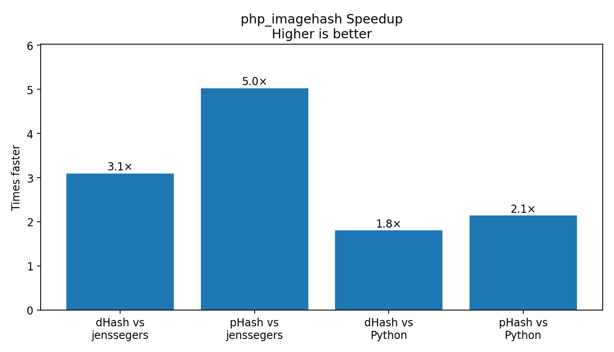
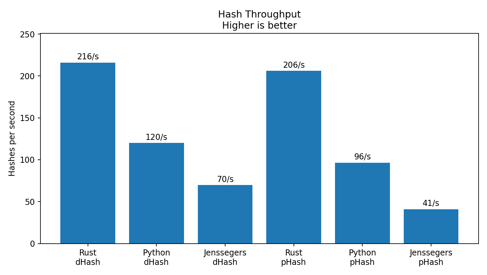
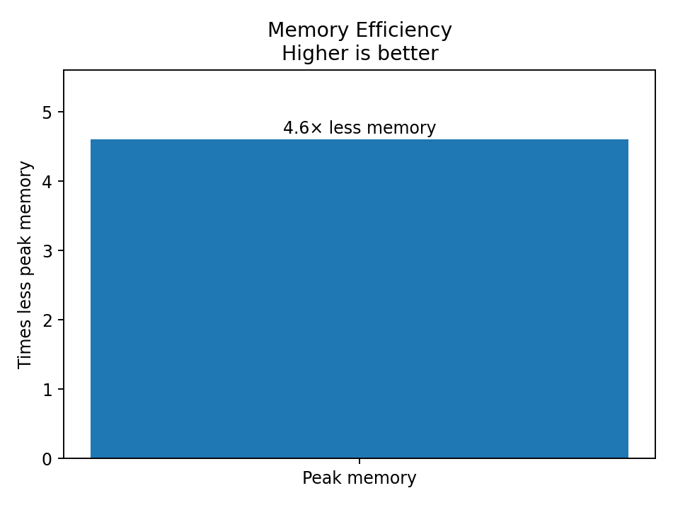
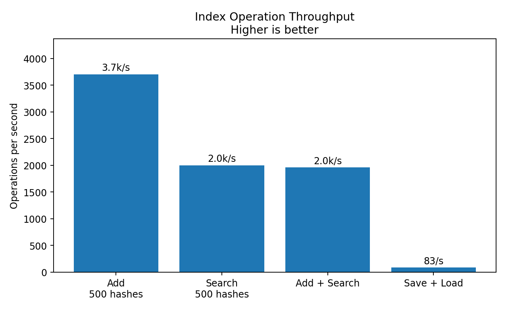
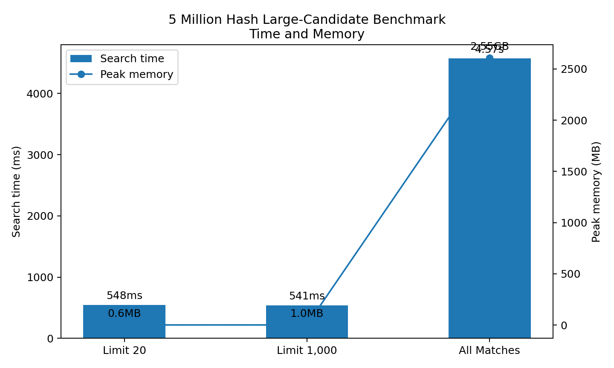

# php_imagehash

[Features](#features) | [Why php-imagehash](#why-php-imagehash) | [Performance](#performance) 
| [API](#api) | [Quick Start](#quick-start) | [Building](#build-and-install) 
| [Docker](#docker-usage) | [Testing](#testing) |  [Benchmarks](#benchmarks) 

`php_imagehash` is a PHP extension written in Rust that provides perceptual image hashing and fast near-duplicate search using `dHash`, `pHash`, Hamming distance, and a bucketed similarity index capable of handling **millions** of hashes.


<span style="color:green">✔</span> dHash & pHash

<span style="color:green">✔</span> Persistent indexes

<span style="color:green">✔</span> Near-duplicate search

<span style="color:green">✔</span> Tested with **>5,000,000** hashes


## Features

- Compute 64-bit perceptual hashes from image files with `image_dhash()` and `image_phash()`
- Measure similarity with `hamming_distance()`
- Store and search image hashes in an in-memory `ImageHashIndex`
- Save and load index data from disk
- Search by hash string or image file path
- Bucketed candidate selection before exact Hamming distance checks

## Why php-imagehash?

Most PHP image hash libraries focus solely on generating perceptual hashes. `php_imagehash` provides:

- dHash & pHash support
- Persistent indexes
- Bucketed similarity search
- Find nearest match
- Near-duplicate image lookup
- Lower memory usage
- Designed with large-scale screenshot and image archives in mind


Candidate pruning means search time is largely independent of result limit.
| Dataset          | Search Limit | Time  |
| ---------------- | ------------ | ----- |
| 5,000,000 hashes | 20           | 548ms |
| 5,000,000 hashes | 1000         | 541ms |
| 5,000,000 hashes | Unlimited    | 4.57s |


## Performance

> Benchmarks were run on 500 generated 256×256 PNG images. Benchmark results depend on hardware, image format, filesystem cache, PHP configuration, and container/runtime environment. These figures are intended as project-level reference numbers, not a universal guarantee.







---

### Hash generation benchmark

| Tool | dHash | dHash throughput | pHash | pHash throughput |
|---|---:|---:|---:|---:|
| `php_imagehash` | 2.316s | ~216 hashes/sec | 2.425s | ~206 hashes/sec |
| Python `ImageHash` | 4.168s | ~120 hashes/sec | 5.184s | ~96 hashes/sec |
| `jenssegers/imagehash` | 7.168s | ~70 hashes/sec | 12.177s | ~41 hashes/sec |

---

### Speedup

| Comparison | dHash | pHash |
|---|---:|---:|
| vs Python `ImageHash` | 1.8× faster | 2.1× faster |
| vs `jenssegers/imagehash` | 3.1× faster | 5.0× faster |

---

### Memory usage

| Metric | `php_imagehash` | `jenssegers/imagehash` | Improvement |
|---|---:|---:|---:|
| Peak memory | 715 KB | 3.3 MB | ~4.6× lower |

---

### Index performance

Benchmarked with 500 precomputed dHashes.



| Operation | Time | Approx throughput |
|---|---:|---:|
| Add 500 hashes | 0.27 ms | ~1.85M ops/sec |
| Search 500 hashes | 0.50 ms | ~1M ops/sec |
| Add + Search | 0.51 ms | ~980K ops/sec |
| Save + Load Index | 12 ms | ~83 ops/sec |

---

### Large Candidate Benchmark

Synthetic worst-case benchmark with 5,000,000 indexed hashes sharing the same bucket prefix.



| Result Limit | Time | Peak Memory |
|---:|---:|---:|
| 20 | 548 ms | 664 KB |
| 1,000 | 541 ms | 1.0 MB |
| all matches | 4.57 s | 2.73 GB |


# API

## Functions

### `imagehash_version(): string`

Returns the compiled extension version string.

### `image_dhash(string $path): string`

Computes and returns the `dHash` of an image file as a 16-character hexadecimal string.

Returns an empty string on failure.

### `image_phash(string $path): string`

Computes and returns the `pHash` of an image file as a 16-character hexadecimal string.

Returns an empty string on failure.

### `hamming_distance(string $a, string $b): int`

Computes the Hamming distance between two hex hashes.

Returns `4294967295` if either hash cannot be parsed.


## Class: `ImageHashIndex`

### `__construct()`

Creates a new empty index.


### `add(string $id, string $hash): bool`


Adds a hash string to the index with a custom identifier.

Returns `true` on success.


### `addImage(string $id, string $path): bool`

Computes the image hash for the given file and adds it to the index.

### `count(): int`

Returns the number of records stored in the index.

### `search(string $hash, int $maxDistance, int $limit): array`

Searches for stored hashes within `maxDistance` of the given hash. maxDistance must be a value between 1 - 64.

Returns up to `limit` matches.

Example return value:

```php
[
    [
        'id' => 'image-123',
        'distance' => '3',
    ],
]
```

### `searchImage(string $path, int $maxDistance, int $limit): array`

Computes the hash for the provided image and searches against the index.

### `nearest(string $hash): array`

Find the closest matching hash.

```php
$index = new ImageHashIndex();
$index->add('exact', 'aaaaaaaaaaaaaaaa');
$index->add('near', 'aaaaaaaaaaaaaaab');
$index->add('far', 'ffffffffffffffff');

$nearest = $index->nearest('aaaaaaaaaaaaaaaa');
print_r($nearest);

```

Example return value:
```php
[
    'id' => 'exact'
    'distance' => 2
]
```

### `nearestImage(string $path): array`

Find the closest matching image.

```php
$index = new ImageHashIndex();

$index->addImage('cat', 'cat.jpg');
$index->addImage('dog', 'dog.jpg');

$match = $index->nearestImage('cat-cropped.jpg');

print_r($match);
```

Example return value:
```php
[
    'id' => 'cat',
    'distance' => 2
]
```

### `save(string $path): bool`

Serializes index data to a file.

### `loadFromFile(string $path): bool`

Loads serialized index data from a file.

### `stats(): array`

Show curent index statistics

```php
$stats = $index->stats();
print_r($stats);
```
Example output

```php
[
    'hashes' => 5000000
    'buckets' => 65536
    'memory_bytes' => 184320000
]
```


| Field        | Description                                      |
| ------------ | ------------------------------------------------ |
| hashes       | Total hashes stored in the index                 |
| buckets      | Internal bucket count used for candidate pruning |
| memory_bytes | Approximate memory used by the index             |


## Quick start

[Download](https://github.com/AllanGallop/libphp_imagehash/releases/tag/v1.0.0) the latest build of `php_imagehash-linux-x86_64-php83.so` and load it directly in PHP without building the extension yourself.

1. Copy or install the release library `php_imagehash-linux-x86_64-php83.so` to a location accessible by PHP.
2. Add the library to `php.ini`:

```ini
extension=/path/to/php_imagehash-linux-x86_64-php83.so
```

3. Restart PHP or your web server if needed.

## Build and install from source

Build from source:

```bash
cargo build --release
```

Then load the shared library from the built release:

```ini
extension=/path/to/libphp_imagehash/target/release/libphp_imagehash.so
```

Generate PHP stubs:

```bash
cargo php stubs --stdout > php_imagehash.stub.php
```

## Docker usage

This repository includes a `Dockerfile` that installs PHP, Composer, Rust, and the build dependencies needed by the extension.

Build the image:

```bash
docker compose build
```

Open a shell:

```bash
docker compose run --rm php-rust bash
```

Build and test inside the container:

```bash
make test
```

## Example usage

```php
<?php

// Show version
echo imagehash_version() . PHP_EOL;

//--------------------------------------------------------------------//

// Compute image hashes
$dhash = image_dhash('/app/tests/fixtures/images/base.png');
$phash = image_phash('/app/tests/fixtures/images/base.png');

echo "dHash: {$dhash}\n";
echo "pHash: {$phash}\n";

//--------------------------------------------------------------------//

// Compare two images
$distance = hamming_distance(
    image_dhash('/app/tests/fixtures/images/base.png'),
    image_dhash('/app/tests/fixtures/images/similar1.png')
);

echo "distance: {$distance}\n";

//--------------------------------------------------------------------//

// Build an index
$index = new ImageHashIndex();

$index->add('base', $dhash);
$index->addImage('similar1', '/app/tests/fixtures/images/similar1.png');
$index->addImage('different', '/app/tests/fixtures/images/different.png');

//--------------------------------------------------------------------//

// Search by hash
$results = $index->search($dhash, 4, 10);
print_r($results);

//--------------------------------------------------------------------//

// Search by image
$resultsByImage = $index->searchImage('/app/tests/fixtures/images/base.png', 4, 10);
print_r($resultsByImage);

//--------------------------------------------------------------------//

// Save and load index
$index->save('/app/tests/outputs/index.bin');

$loaded = new ImageHashIndex();
$loaded->loadFromFile('/app/tests/outputs/index.bin');

//--------------------------------------------------------------------//

// Find nearest matching image
$index = new ImageHashIndex();

$index->addImage('similar', '/app/tests/fixtures/images/similar.png');
$index->addImage('different', '/app/tests/fixtures/images/different.png');

print_r($index->nearest('upload.png'));
```

## Testing

Run the PHP test suite:

```bash
make test
```

Individual test targets may include:

```bash
make test-basic
make test-image
make test-persistence
make test-similarity
```

## Benchmarks

Generate benchmark images:

```bash
php benchmarks/generate_images.php 500
```

Run hash benchmarks:

```bash
make bench-hash
```

Run index benchmarks:

```bash
make bench-index
```

Run the full benchmark flow:

```bash
make bench-full
```

Python comparison benchmark:

```bash
make bench-python
```

## Notes

- `image_dhash()` currently uses a 9×8 resized grayscale image and computes a 64-bit difference hash.
- `image_phash()` currently uses a resized grayscale image and a DCT-based perceptual hash.
- The extension stores hashes internally as 64-bit values.
- Searches use bucketed candidate selection before exact Hamming distance checks.
- Use `maxDistance` to control how close matches must be.
- Current release artifacts target Linux shared libraries. Windows DLL support may be added later.

## Repository structure

- `src/lib.rs` - Rust source for the PHP extension
- `tests/` - PHP tests and fixtures
- `benchmarks/` - PHPBench benchmarks and generated benchmark images
- `.githubimages/` - README benchmark charts
- `.github/workflows/` - CI and release automation
- `Cargo.toml` - Rust crate metadata and dependencies
- `composer.json` - PHP benchmark/test dependencies
- `Dockerfile` - container environment for building/testing
- `Makefile` - common build, test, stub, and benchmark commands
